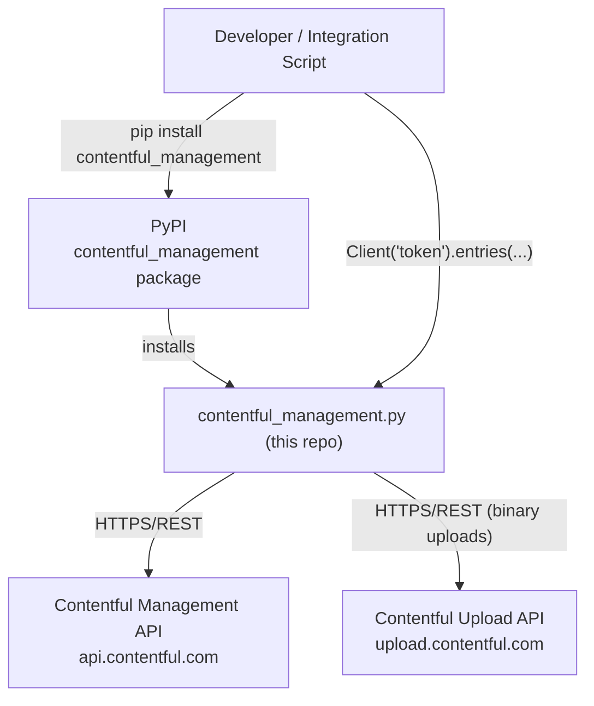

# Architecture

<!-- Generated by seed-golden-context | Last updated: 2026-05-04 -->

## Overview

`contentful-management.py` is the official Python client for the [Contentful Management API (CMA)](https://www.contentful.com/developers/docs/references/content-management-api/). It provides a Pythonic interface to every CMA endpoint — creating and updating spaces, environments, content types, entries, assets, webhooks, roles, API keys, and taxonomy concepts. The library serializes/deserializes JSON API responses into typed Python objects and handles authentication, rate limiting, and retries transparently.

## System Context



**Upstream (consumes):**
- Contentful Management API (`api.contentful.com`) — all read/write operations
- Contentful Upload API (`upload.contentful.com`) — binary asset uploads

**Downstream (consumes this repo):**
- Any Python script, app, or integration that needs programmatic management of Contentful spaces
- Contentful-provided tooling (e.g., `contentful-export`, `contentful-import`) that wraps the Python SDK

## Internal Structure

| Module/File | Purpose |
|---|---|
| `contentful_management/client.py` | Entry point. `Client` class handles auth, HTTP, rate-limit retries, and exposes all proxy factory methods. |
| `contentful_management/client_proxy.py` | Base `ClientProxy` class — generic CRUD (`all`, `find`, `create`, `delete`) delegated to `Client._get/_post/_put/_delete`. |
| `contentful_management/*_proxy.py` | One proxy per resource type. Inherit from `ClientProxy` or `SpaceResourceProxy`/`EnvironmentResourceProxy`. Proxy classes are scope containers (hold `space_id`, `environment_id`), not HTTP clients. |
| `contentful_management/resource.py` | Base `Resource` class — deserializes `sys` block, provides `update`, `delete`, `publish`, `archive`, etc. Subclasses: `FieldResource`, `PublishResource`, `ArchiveResource`. |
| `contentful_management/resource_builder.py` | `ResourceBuilder` — factory that inspects `sys.type` in an API response and instantiates the correct Python class. |
| `contentful_management/*.py` (entities) | One file per CMA resource type: `entry.py`, `asset.py`, `space.py`, `environment.py`, `content_type.py`, `webhook.py`, etc. |
| `contentful_management/errors.py` | HTTP error class hierarchy: `HTTPError` → `BadRequestError`, `UnauthorizedError`, `NotFoundError`, `RateLimitExceededError`, etc. |
| `contentful_management/utils.py` | Helpers: `snake_case`/`camel_case` conversion, `normalize_select`, `retry_request` decorator, `ConfigurationException`. |
| `contentful_management/array.py` | `Array` — wraps paginated list responses with `items`, `total`, `skip`, `limit`. |
| `tests/` | `unittest`-based test suite, one file per module. All HTTP is mocked with VCR cassettes in `fixtures/`. |
| `fixtures/` | VCR cassette YAML fixtures, organized by resource type. Tests record/replay against real API responses. |
| `_docs/` | Sphinx documentation source (auto-generated into `docs/`). Do not hand-edit `docs/` — it is re-generated by `pdm run docs`. |

## Data Flow

```
Developer code
  │
  ▼
Client('token').entries('space_id', 'env_id')          # returns EntriesProxy
  │
  ▼
EntriesProxy.all(query={'content_type': 'blogPost'})   # calls Client._get(url, query)
  │
  ▼
Client._get → retry_request decorator → requests.get   # HTTPS to api.contentful.com
  │
  ▼
HTTP 200 JSON response
  │
  ▼
ResourceBuilder.build()                                 # inspects sys.type → Array of Entry objects
  │
  ▼
Python list of Entry instances with .sys, .fields, .publish(), .update(), etc.
```

**Upload flow (binary assets):**
Client.uploads('space_id').create({'upload': file_object}) → `upload.contentful.com` (separate endpoint, separate URL config).

**Rate-limit retry flow:**
`retry_request` decorator intercepts `RateLimitExceededError` (HTTP 429), reads `x-contentful-ratelimit-reset` header, sleeps with jitter (1.0–1.2× reset time), and retries up to `max_rate_limit_retries` times (default: 1).

## Domain Concepts

| Concept | Description |
|---|---|
| **Space** | Top-level organizational unit in Contentful. Contains environments, API keys, webhooks, and roles. |
| **Environment** | A named snapshot/branch within a space (e.g., `master`, `staging`). Content types, entries, and assets are environment-scoped. |
| **Content Type** | Schema definition. Defines fields and their types. Must be published before entries can reference it. |
| **Entry** | A single content item conforming to a content type. Lifecycle: Draft → Published → Archived. |
| **Asset** | Binary file (image, video, PDF). Has a separate two-step lifecycle: create → process → publish. |
| **Snapshot** | Immutable historical copy of an entry or content type at a given version. |
| **Tag** | Metadata tag attached to entries/assets for organizational filtering. |
| **Taxonomy Concept / Concept Scheme** | Hierarchical controlled vocabulary (SKOS-based). Organization-scoped (not space-scoped). Added in v2.15.0. |
| **sys** | Every resource has a `sys` block containing `id`, `type`, `version`, `createdAt`, `updatedAt`, and optional `publishedAt`, `archivedAt`. |
| **Link** | A reference object `{'sys': {'type': 'Link', 'linkType': 'Entry', 'id': '...'}}`. Used for relationships between resources. |

**Version management:** CMA uses optimistic concurrency — all mutating calls (update, publish, delete) require passing the current `version` from `sys`. A mismatch returns HTTP 409 `VersionMismatchError`.

## Key Dependencies

| Dependency | Why |
|---|---|
| `requests` (>=2.32.4, <3) | HTTP client for all CMA API calls. Range versioning added in DX-886 for broader compatibility. |
| `python-dateutil` (>=2.9.0) | Parses ISO 8601 date strings from API responses into `datetime` objects. |
| `vcrpy` (test only) | Records/replays HTTP interactions as YAML cassettes for deterministic, offline tests. |
| `tox` (test only) | Runs the test matrix across Python 3.9–3.12. |
| `flake8` (dev only) | Linting. Configured in `tox.ini` `[flake8]` section. |
| `pdm` | Package manager. Manages virtual environment, dependencies, and publishing. Chosen as the standard Python tooling across DX SDK repos. |

## Configuration

All configuration is passed to `Client()` at instantiation — no environment variables or config files are read by the library itself.

| Parameter | Purpose | Default |
|---|---|---|
| `access_token` | Contentful Management API token (required) | — |
| `api_url` | CMA base URL | `api.contentful.com` |
| `uploads_api_url` | Upload API base URL | `upload.contentful.com` |
| `api_version` | CMA API version (must be ≥ 1) | `1` |
| `default_locale` | Default locale for field access | `en-US` |
| `https` | Use HTTPS vs HTTP | `True` |
| `raw_mode` | Return raw `requests.Response` instead of parsed objects | `False` |
| `gzip_encoded` | Accept gzip-encoded responses | `True` |
| `raise_errors` | Raise `HTTPError` subclasses on non-2xx responses | `True` |
| `proxy_host` / `proxy_port` / `proxy_username` / `proxy_password` | HTTP proxy config | `None` |
| `max_rate_limit_retries` | Max retries after 429 before raising | `1` |
| `max_rate_limit_wait` | Max seconds to wait for rate limit reset | `60` |
| `application_name` / `application_version` | Injected into `X-Contentful-User-Agent` header | `None` |
| `integration_name` / `integration_version` | Integration metadata for user-agent header | `None` |
| `additional_headers` | Extra headers added to every request | `{}` |

## Operational Knowledge

### Deployment

This is a PyPI library, not a running service. Releases are published to PyPI via `pdm run release` (which runs `clean` → `git-docs` → `pdm publish`).

See the [Python SDK Runbook](https://contentful.atlassian.net/wiki/spaces/ECO/pages/5305073688) for step-by-step release instructions.

**PDM cache issue:** If `pdm run release` fails with dependency resolution errors, run `pdm cache clean` and retry.

### Failure Modes

| Failure | Symptom | Resolution |
|---|---|---|
| `ConfigurationException` | Raised at `Client()` instantiation | Check `access_token`, `api_url`, `default_locale`, `api_version` |
| `RateLimitExceededError` | HTTP 429; max retries exhausted | Increase `max_rate_limit_retries` or `max_rate_limit_wait`; check API usage |
| `VersionMismatchError` | HTTP 409 on update/publish/delete | Re-fetch the resource to get the latest `sys.version` before mutating |
| `UnauthorizedError` | HTTP 401 | Token is invalid or expired |
| `AccessDeniedError` | HTTP 403 | Token lacks permission for the requested resource/action |
| `NotFoundError` | HTTP 404 | Space, environment, or resource ID is wrong |

### Monitoring

This is a client library — there are no server-side dashboards. Monitor via:
- GitHub Actions CI: https://github.com/contentful/contentful-management.py/actions
- Backstage service catalog: service tier 4, owned by `group:team-developer-experience`
- CI alerts: `#sdk-bots` Slack channel

### Incident Playbook

[NEEDS TEAM INPUT] — This is a Tier 4 library. For issues affecting users, triage via GitHub Issues and the `#sdk-contractors` channel for external contribution coordination.
